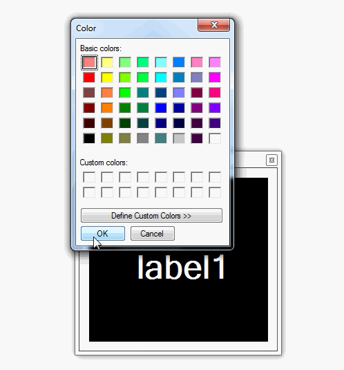

 Text Contrast Test
=========

This uses the following method to determine if black or white text should be used over a specified background color.

https://en.wikipedia.org/wiki/YIQ

Here's an animation of what it does. Pretty simple!

